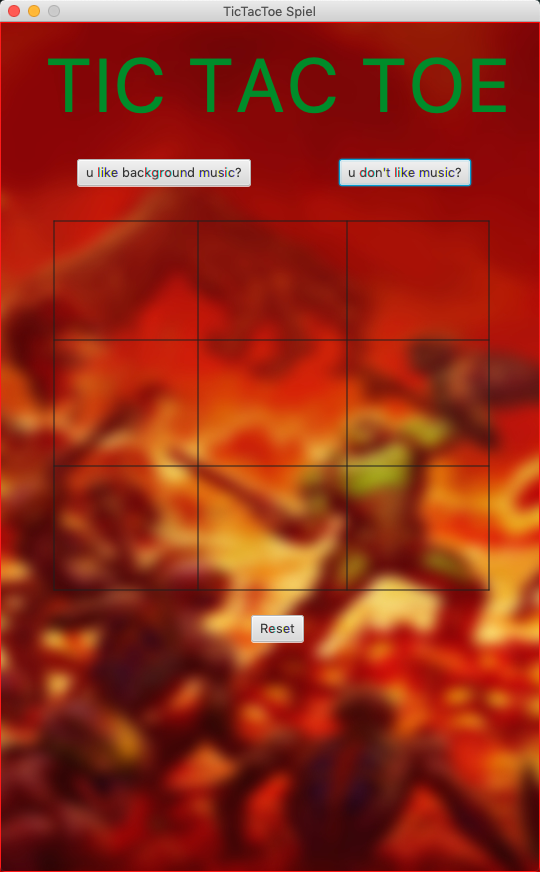
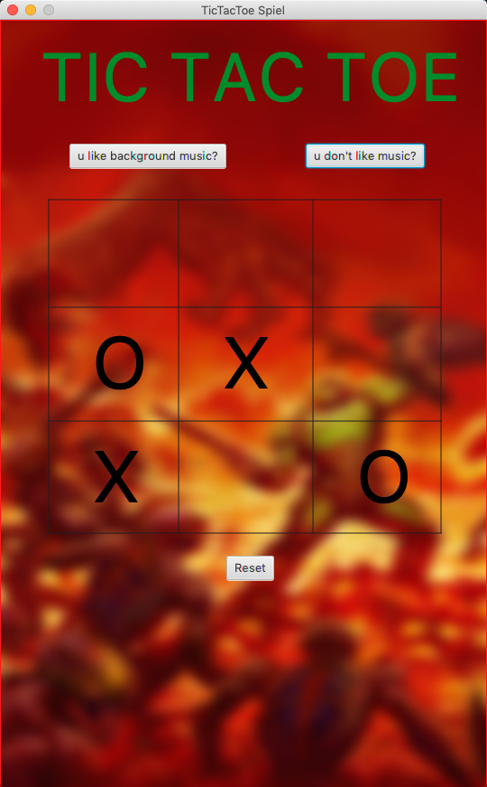
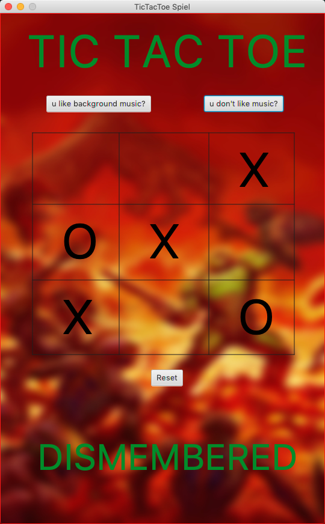
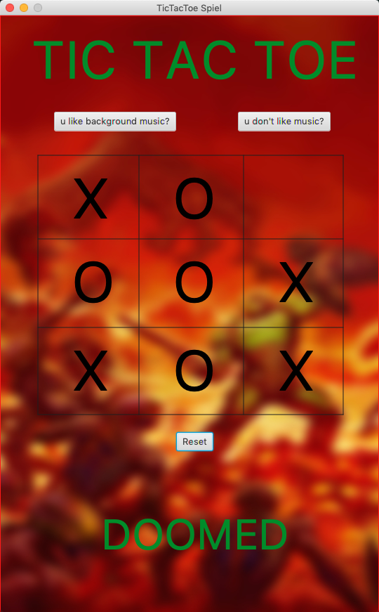

# Tic Tac Toe
Tic Tac Toe was one of my very first games I have ever developed.
  

    
    
    
    

 
The gameplay is very simple - on a square field of 3 x 3 squares, the two players place their signs (one player crosses, the other circle) alternately in a free space. The player who is the first to place three characters in a row, column or diagonal wins. In my game the player places crosses and the enemy Ai places circles. One little feature is you can play some background music during the game if you like and it is also possible to reset the game.
